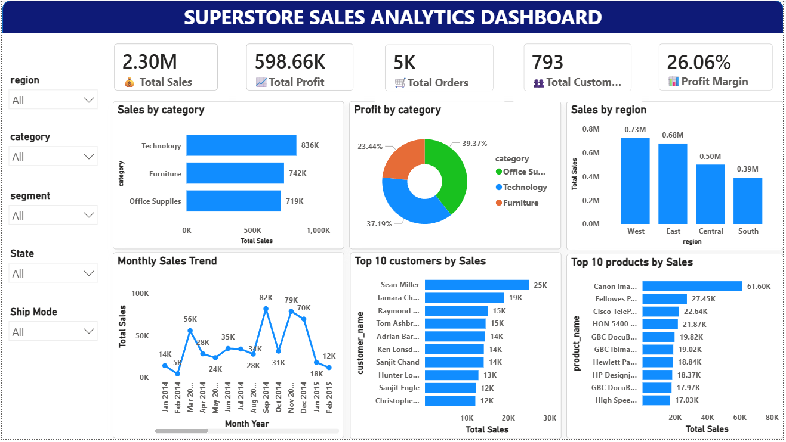
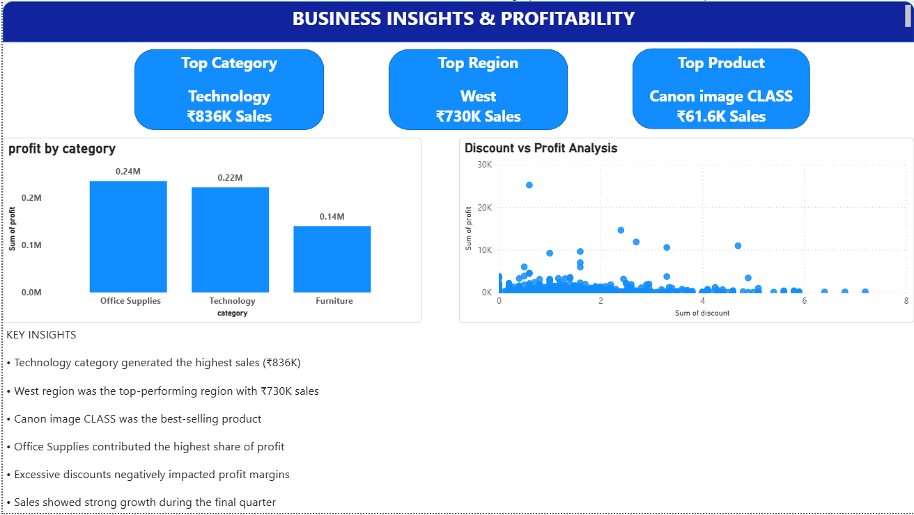

# Superstore Sales & Profitability Analytics

## Project Overview
This is an end-to-end Data Analytics project built using Excel, Pandas, PostgreSQL, and Power BI. The project analyzes sales performance, profitability, customer behavior, and product trends using the Superstore dataset.

## Tools Used
- Excel
- Python (Pandas)
- PostgreSQL
- Power BI

## Project Workflow
1. Data Cleaning in Excel
2. Exploratory Data Analysis (EDA) using Pandas
3. Data Modeling and SQL Analysis in PostgreSQL
4. Interactive Dashboard Development in Power BI

## Key Insights
- Technology generated the highest sales (₹836K)
- West region contributed the highest revenue (₹730K)
- Canon image CLASS was the best-selling product
- Office Supplies generated the highest profit
- Higher discounts negatively impacted profitability

## Dashboard Preview

### Dashboard Page 1

### Dashboard Page 2

